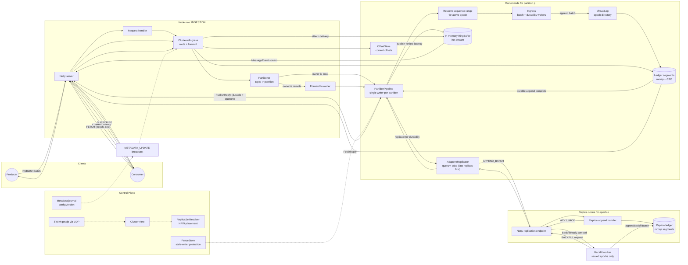

# RingBroker — High-Performance Clustered Log Broker on Java 21


[](https://opensource.org/licenses/GPL-3.0)

RingBroker is a high-throughput, low-latency **clustered messaging broker** built for mechanical sympathy:
lock-free hot paths, batch-oriented I/O, memory-mapped persistence, and modern Java concurrency (Virtual Threads).

It’s designed as a **partitioned, replicated log** with a fast in-memory delivery path backed by durable
append-only storage — plus **cluster semantics** for epoch-based placement, rebalancing, and recovery
*without running Raft*.

---

## Highlights

- **Extreme throughput** on commodity hardware  
  Benchmarks observed locally (Dell Precision 3590):  
  - **Ingestion path:** ~**15M msg/s** (JMH)  
  - **Persistence path:** ~**6M msg/s** (JMH)
  - **Frontdoor (INGESTION->PERSISTENCE Quorum e2e):** ~**2.7M msgs/s**

- **Clustered by design (no Raft)**
  - **Epoch-based logs** per partition: `epoch-XXXXXXXX` directories under each partition
  - **Durable fencing** across restarts (`FenceStore`) to prevent stale writers
  - **Journaled metadata** (`JournaledLogMetadataStore`) + **broadcast updates** (`BroadcastingLogMetadataStore`)
  - **Background backfill** for sealed epochs missing locally (self-healing placement)

- **Role separation**
  Nodes can run as:
  - `INGESTION`: front-door; partition routing, forwarding, per-partition pipelines
  - `PERSISTENCE`: durable storage; owns epoch segments + replication acks + fetch/backfill serving

- **Per-partition serialized pipelines**
  - One virtual-thread “pipeline” per owned partition (`PartitionPipeline`)
  - Batching, ordering, and commit completion handled in a single place
  - Replication waits are offloaded to a dedicated IO executor (keeps pipelines hot)

- **Lock-free, allocation-avoiding hot path**
  - Bounded MPMC ring for ingestion batching (`Ingress.SlotRing`)
  - Low-allocation MPSC pipeline queue for control + publish (`PartitionPipeline.MpscQueue`)
  - Reused batch buffers, `VarHandle` ordering semantics, padding to reduce false sharing

- **Durable, recoverable storage**
  - Append-only **memory-mapped segments** (`LedgerSegment`)
  - CRC validation + crash-safe recovery scans
  - Background segment pre-allocation + dense index building (`.idx`) for fast fetch

- **Adaptive replication**
  - Latency-aware quorum: waits on the fastest replicas first (EWMA-based)
  - Failover-safe: if a replica fails/times out, starts another attempt to still reach quorum
  - Slow replicas are updated asynchronously after quorum is reached

- **High-performance networking**
  - Netty transport for client and inter-broker communication
  - Protobuf envelope framing, low overhead request dispatch

---

## Architecture Overview

RingBroker’s clustered write path is **route → reserve → append → replicate → complete**:

1. **Partitioning** chooses the partition for a message (`Partitioner`).
2. **Ownership** resolves the partition owner node (`partitionId % clusterSize` in current wiring; customizable).
3. If local owner: the partition’s **pipeline** reserves a contiguous seq range and enqueues payloads to `Ingress`.
4. `Ingress` batches payloads and appends to the **epoch log** (`VirtualLog → LedgerOrchestrator → LedgerSegment`).
5. After durability completes, the owner triggers **adaptive quorum replication** to the epoch’s storage nodes.
6. The pipeline completes publish futures only after durable + quorum success.

Read paths are split:
- **Streaming**: hot in-memory delivery from the `RingBuffer` via per-subscriber virtual threads (`Delivery`).
- **Fetch/Replay**: durable reads from the epoch log via `FETCH` (LSN = `(epoch, seq)`).

---

## Core Cluster Concepts

### Partitions
Topics are split into partitions. Each partition is owned by a node (current default: `partitionId % clusterSize`).

Each owned partition maintains:
- a serialized `PartitionPipeline` (ordering + batching + replication orchestration)
- `Ingress` (queue → batch → durable append → ring publish)
- `RingBuffer<byte[]>` (hot in-memory stream)
- `Delivery` (subscription streaming from ring)
- on-disk **epoch logs** via `VirtualLog`

### Epochs (Rebalance Unit)
Each partition is a sequence of epochs:
- An **epoch** is an append-only log with its own storage placement.
- Sealed epochs become immutable and can be safely backfilled to nodes that must host them.
- The active epoch is tracked in **metadata** and **fenced** on disk to prevent stale writers after restarts.

### Metadata (No Raft)
RingBroker uses a durable, serialized **local journal** for metadata:
- `JournaledLogMetadataStore` persists per-partition `LogConfiguration` (epochs, placement, configVersion).
- `BroadcastingLogMetadataStore` broadcasts metadata updates to peers; receivers keep the highest `configVersion`.

**Important:** the design keeps the data-plane hot and avoids consensus overhead, while using:
- epoch fencing,
- monotonic config versions,
- sealed-epoch immutability,
- and replica readiness rules
to keep the system safe and recoverable.

---

## Data Model & Wire Protocol

RingBroker uses Protobuf (`BrokerApi.Envelope`) as the wire format. Primary envelope kinds include:

- `PUBLISH` / `BATCH` — publish messages
- `APPEND` / `APPEND_BATCH` — inter-broker replication for a specific (partition, epoch, seq range)
- `SEAL` / `OPEN_EPOCH` — epoch control plane for rollover and placement evolution
- `METADATA_UPDATE` — metadata broadcast (highest `configVersion` wins)
- `FETCH` — durable read by LSN (epoch + seq)
- `BACKFILL` — transfer sealed epoch data to nodes missing it
- `SUBSCRIBE` — stream message events (in-memory delivery)
- `COMMIT` / `COMMITTED` — consumer offset management

On the server, `NettyServerRequestHandler` dispatches each request to the broker components
(`ClusteredIngress`, `OffsetStore`, etc.).

---

### Flow Chart

### Flow Chart



---

## Write Path (Clustered Durable Ingest)

### PartitionPipeline: the ordered control + data plane
Each owned partition runs a single virtual-thread pipeline that:
- batches publishes by `(topic, retries)`
- reserves contiguous sequence ranges per epoch (monotonic)
- enqueues payloads into `Ingress` (fast path)
- waits for durability **without blocking the hot path**
- triggers ordered replication to the epoch’s replica set
- completes publish futures after durable + quorum commit

Backpressure is explicit and per-partition:
- caps on in-flight batches and bytes (`MAX_INFLIGHT_*`) to prevent OOM under async load

### Ingress: lock-free batch ingest
`Ingress.publishForEpoch(...)` enqueues payloads into a bounded MPMC ring (`SlotRing`) with no per-message allocation.

The writer loop:
- drains the ring into a reusable batch buffer
- appends to the epoch ledger (`VirtualLog → LedgerOrchestrator → LedgerSegment`)
- optionally forces flush on persistence nodes (`forceDurableWrites`)
- publishes the batch into the `RingBuffer` for low-latency streaming
- completes durability waiters (`whenPersisted(epoch, seq)`)

### Storage: epoch logs + mmap segments
Each partition contains per-epoch directories:
- `partition-N/epoch-0000000000/…`
- `partition-N/epoch-0000000001/…`

Segments are:
- append-only, memory-mapped (`.seg`)
- crash-recoverable via scan + CRC validation
- optionally accelerated with a dense offset index (`.idx`) built off-thread

---

## Replication

Replication is coordinated by `AdaptiveReplicator`:
- maintains EWMA latency per replica node
- selects the fastest candidates first
- waits for `ackQuorum` successes before committing
- on failure/timeouts, starts additional attempts to still reach quorum
- propagates to remaining replicas asynchronously after quorum

Inter-broker correlation uses a **connection-local correlationId** to avoid collisions.

---

## Metadata, Epoch Control, and Rebalancing (No Raft)

RingBroker avoids consensus for cheaper rebalancing and a very hot data plane:

- **Log metadata** is stored locally and durably:
  - `JournaledLogMetadataStore` persists `LogConfiguration` per partition
  - each config contains an ordered list of epochs: `(epochId, startSeq, endSeq, placement, tieBreaker)`
  - config changes are serialized per-writer process (single-writer assumption per partition)

- **Broadcast updates** share the latest configuration:
  - `BroadcastingLogMetadataStore` broadcasts `METADATA_UPDATE` to peers
  - receivers adopt the highest `configVersion`

- **Fencing** persists safety across restarts:
  - `FenceStore` stores `highestSeenEpoch` and per-epoch seal state on disk
  - replicas reject stale epochs and enforce contiguous acceptance (`ERROR_REPLICA_NOT_READY` on gaps)

- **Epoch rollover**:
  - active epoch seals at the persisted end sequence
  - a new epoch is opened with placement computed by `ReplicaSetResolver`
  - sealed epochs are immutable and safe to backfill/rebuild anywhere required by placement

### Backfill (sealed epochs)
Nodes periodically scan metadata for sealed epochs they should store but don’t have on disk:
- request `BACKFILL` from a node that has the epoch
- append received records using `appendBackfillBatch(epoch, ...)`
- mark epoch present and continue until end-of-epoch

---

## Read Path

### Streaming (low latency)
`Delivery` streams from the in-memory `RingBuffer`:
- each subscriber runs on its own virtual thread
- consumers receive `(sequence, payload)` in-order per partition

### Fetch (durable replay)
`FETCH` reads from durable storage using LSN:
- LSN encodes `(epoch, seq)`
- server may respond with redirects when the epoch is not present locally
- reads traverse segments and return up to `maxMessages`

---

## Consumer Offsets

`OffsetStore` tracks committed offsets per `(topic, group, partition)`.
The included `InMemoryOffsetStore` provides:
- fast in-memory layout (nested map + partition offset array)
- async WAL persistence via a background virtual thread (batch flushed to a ledger)

---

## Key Modules

- `io.ringbroker.broker.ingress.ClusteredIngress` — routing, forwarding, per-partition pipelines, replication orchestration
- `io.ringbroker.broker.ingress.Ingress` — queue → batch → epoch ledger append → ring publish + durability waiters
- `io.ringbroker.broker.delivery.Delivery` — per-subscriber VT streaming from ring
- `io.ringbroker.cluster.membership.gossip.impl.SwimGossipService` — SWIM-style UDP membership
- `io.ringbroker.cluster.membership.resolver.ReplicaSetResolver` — replica placement via HRW hashing
- `io.ringbroker.cluster.membership.replicator.AdaptiveReplicator` — EWMA-based quorum replication + async tail
- `io.ringbroker.cluster.metadata.JournaledLogMetadataStore` — durable per-partition metadata journal
- `io.ringbroker.cluster.metadata.BroadcastingLogMetadataStore` — broadcasts metadata updates to peers
- `io.ringbroker.ledger.orchestrator.VirtualLog` — per-epoch orchestration under `epoch-XXXXXXXX` dirs
- `io.ringbroker.ledger.segment.LedgerSegment` — mmap segment + CRC + dense index support
- `io.ringbroker.transport.impl.NettyServerRequestHandler` — Netty server pipeline and dispatch

---

## Semantics (Current)

- **Ordering:** ordered by partition and epoch; sequence increases monotonically within an epoch.
- **Durability:** durable append-only epoch log; flush strength depends on `forceDurableWrites`.
- **Replication:** quorum acknowledgement on fastest replicas; async propagation to remaining replicas.
- **Rebalancing:** placement evolves by epoch; sealed epochs are immutable and transferable via backfill.
- **Delivery:** low-latency in-memory streaming for hot consumers; durable replay via fetch by LSN.
- **Idempotence (optional):** per-partition dedupe set using message hash.

---

## Build & Benchmark

### Prerequisites
- Java 21+
- Gradle (wrapper recommended)

### Build
```bash
./gradlew clean build
```

### JMH
```bash
.\gradle jmh
```

---

