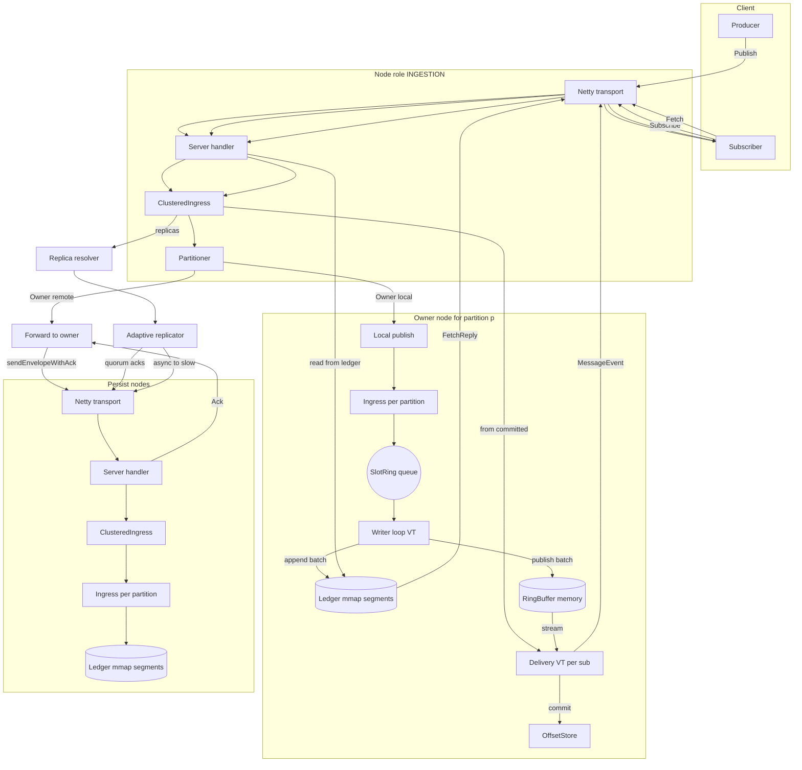

# RingBroker — High-Performance Distributed Messaging on Java 21


[](https://opensource.org/licenses/GPL-3.0)

RingBroker is a high-throughput, low-latency distributed messaging system built for mechanical sympathy: lock-free hot paths, batch-oriented I/O, memory-mapped persistence, and modern Java concurrency (Virtual Threads).

It is designed as a **partitioned, replicated log** with a fast in-memory delivery path backed by a durable append-only ledger.

---

## Highlights

- **Extreme throughput** on commodity hardware  
  Benchmarks observed locally (Dell Precision 3590):  
  - **Ingestion path:** ~**15M msg/s** (JMH)  
  - **Persistence path:** ~**6M msg/s** (JMH)

- **Role separation**  
  Nodes can run as:
  - `INGESTION`: front-door; partition routing + quorum replication orchestration
  - `PERSISTENCE`: durable storage; owns ledger segments for assigned partitions

- **Lock-free, allocation-avoiding hot path**
  - Custom bounded MPMC queue (`Ingress.SlotRing`)
  - Reused batch buffers (`ByteBatch`)
  - `VarHandle` + `Unsafe` ordering semantics, padding to reduce false sharing

- **Durable, recoverable storage**
  - Append-only **memory-mapped segments** (`LedgerSegment`)
  - CRC validation, crash-safe recovery scans
  - Background segment pre-allocation and dense index building

- **Adaptive replication**
  - Latency-aware quorum: waits on the fastest replicas first (EWMA-based)
  - Slow replicas are updated asynchronously for eventual durability

- **High-performance networking**
  - Netty transport for client and inter-broker communication
  - Protobuf framing and encoding, low overhead request handling

---

## Architecture Overview

RingBroker’s write path is **batch → append → publish**:

1. **Partitioning** chooses the owner for a message (`Partitioner`).
2. The owner performs **local publish** into partition-specific `Ingress` (or forwards to the owner if remote).
3. `Ingress` batches payloads from a lock-free queue and appends to the **ledger** (mmap).
4. The same batch is published into an in-memory **RingBuffer** for low-latency delivery.
5. The owner triggers **replication** to persistence replicas using adaptive quorum acknowledgements.

### Flow Chart (Mermaid)

> Note: Some renderers require Mermaid diagrams to be in a fenced code block with language `mermaid`.
> If your renderer supports that, change the fence below to: ```mermaid


---

## Core Concepts

### Partitions
Topics are split into partitions. Each partition is owned by a node (owner selection is currently `partitionId % clusterSize` in `ClusteredIngress`, with support for custom `Partitioner`).

Each owned partition maintains:
- `Ingress` (durable write pipeline)
- `RingBuffer<byte[]>` (hot in-memory stream)
- `Delivery` (subscription streaming from ring)

### Node Roles

#### `INGESTION`
- Handles inbound PUBLISH/BATCH requests
- Computes partition ownership
- Writes locally if owner, otherwise forwards to owner
- Coordinates replication (quorum) when owner

#### `PERSISTENCE`
- Owns partitions and the ledger data
- Performs durable append
- Serves fetch/replay and stream delivery

---

## Data Model & Wire Protocol

RingBroker uses Protobuf (`BrokerApi.Envelope`) as the wire format. Primary envelope kinds include:

- `PUBLISH` / `BATCH` — publish messages (optionally with retries)
- `FETCH` — read from durable ledger by (partition, offset, maxMessages)
- `SUBSCRIBE` — stream message events (in-memory delivery from ring)
- `COMMIT` / `COMMITTED` — consumer offset management

On the server, `NettyServerRequestHandler` dispatches each request to the corresponding broker component (`ClusteredIngress`, `OffsetStore`, etc.).

---

## Write Path (Durable Ingest)

### Ingress: lock-free batch ingest
`Ingress.publish(...)` performs topic validation and DLQ routing, then enqueues the payload into a bounded MPMC ring (`SlotRing`) without allocating per-batch objects.

The background `writerLoop()`:
- drains the queue
- forms a batch in a reusable buffer (`byte[][]`)
- appends the batch to the ledger (optionally forced flush for durability)
- publishes batch entries into the `RingBuffer`

### Ledger: append-only mmap segments
`LedgerOrchestrator` manages segment lifecycle:
- recovery on startup (scan + CRC checks + truncation on corruption)
- rollover and background pre-allocation
- optional dense per-segment offset index (`.idx`) for O(1) position lookups

---

## Replication

Replication is coordinated by `AdaptiveReplicator`:
- maintains EWMA latency per replica
- selects the fastest `ackQuorum` replicas for the critical path
- waits for success acknowledgements within a timeout
- updates EWMA on each completed ack
- pushes to slower replicas asynchronously after quorum is reached

**Transport note:** inter-broker send-with-ack uses a **connection-local correlationId** to prevent correlation collisions.

---

## Read Path

### Streaming (low-latency)
`Delivery` streams from the in-memory `RingBuffer`:
- each subscriber runs on its own **virtual thread**
- `ring.get(sequence)` blocks using `WaitStrategy` + `Barrier`
- delivered as `(sequence, payload)` to the handler

### Fetch (durable replay)
For replay or cold consumers, `FETCH` reads from the durable ledger:
- traverses segment(s) and returns up to `maxMessages`
- uses `MappedByteBuffer.duplicate()` for isolated zero-copy-ish views

---

## Consumer Offsets

`OffsetStore` tracks committed offsets per (topic, group, partition).  
The included `InMemoryOffsetStore` provides:
- a fast in-memory map/array layout for hot reads/writes
- async WAL persistence via a background virtual thread (batch flushed to a ledger)

In `subscribeTopic(...)`, offsets are fetched at subscription start and committed per message.

---

## Key Modules

- `io.ringbroker.broker.ingress.ClusteredIngress` — routing, forwarding, local writes, replication orchestration
- `io.ringbroker.broker.ingress.Ingress` — queue → batch → ledger append → ring publish
- `io.ringbroker.broker.delivery.Delivery` — per-subscriber VT streaming from ring
- `io.ringbroker.core.ring.RingBuffer` — batch claim/publish + wait strategies
- `io.ringbroker.ledger.orchestrator.LedgerOrchestrator` — segment lifecycle + recovery + indexing
- `io.ringbroker.ledger.segment.LedgerSegment` — mmap segment with CRC + dense index support
- `io.ringbroker.cluster.membership.replicator.AdaptiveReplicator` — EWMA-based fast quorum + async slow replication
- `io.ringbroker.cluster.client.impl.NettyClusterClient` — envelope send + correlationId/future ack mapping
- `io.ringbroker.transport.type.NettyTransport` / `NettyServerRequestHandler` — Netty server pipeline and dispatch
- `io.ringbroker.cluster.membership.gossip.impl.SwimGossipService` — SWIM-style UDP membership view

---

## Semantics (Current)

- **Ordering:** ordered by partition; offsets/sequence increase monotonically.
- **Durability:** append-only ledger provides durable storage; durability strength depends on forced flush configuration + replication.
- **Replication:** quorum-based acknowledgement on fast replicas; background propagation to slower replicas.
- **Idempotence (optional):** per-partition dedupe set using `(partition, hash(key), hash(payload))`.
- **Delivery:** optimized in-memory stream for hot consumers; durable replay via fetch.

---

## Build & Benchmark

### Prerequisites
- Java 21+
- Gradle (wrapper recommended)

### Build
```bash
./gradlew clean build
